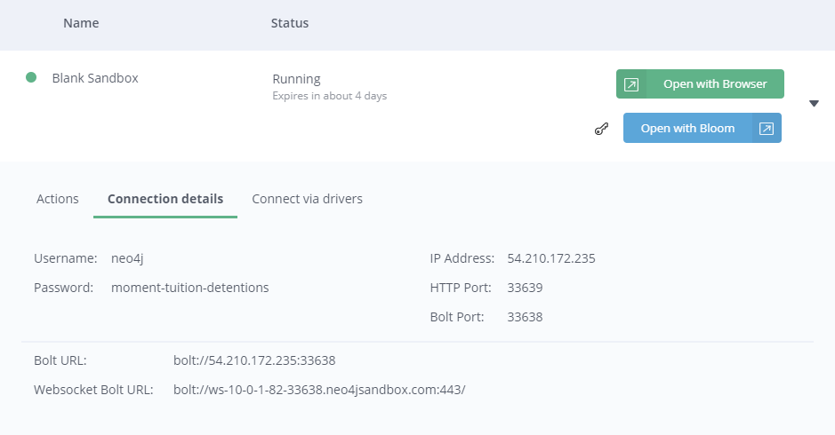
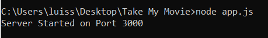

# SIBI
Documentos relacionados con la asignatura SISTEMAS DE INFORMACIÓN DE GESTION Y BUSINESS INTELLIGENGE
# Take My Movie

Take My Movie es un proyecto que consta de una página web online de películas, la cual cuenta con un sistema de recomendación de las mismas en base a búsquedas previas

## Comenzando 🚀

Estas instrucciones te permitirán obtener una copia del proyecto en funcionamiento en tu máquina local para propósitos de desarrollo y pruebas


### Pre-requisitos 📋

Qué cosas necesitas para instalar el software y como instalarlas

```
Visual Studio Code, Sublime Text, etc. Cualquier editor de texto.
```

### Instalación 🔧

Descargar en formato ZIP el archivo Take My Movie del Github (y extraerlo) donde se podrán encontrar los diferentes archivos

```
/public, /views, /app.js, /package-lock.json, /package.json
```

Arrancar una terminal **cmd**, posicionarse en el directorio donde se encuentre la carpeta anteriormente descargada y utilizar este comando

```
npm install
```

Si todo ha ido bien, se nos creará una carpeta dentro del propio folder "Take My Movie" que se llame "node_modules".
Esto nos permitirá utilizar el Nodejs para hacer funcionar la página web.

Lo siguiente que habría que hacer es dirigirse a https://sandbox.neo4j.com/ y crear un nuevo proyecto donde vamos a insertar todos los datos de mis .csv
Al crear la sandbox, insertaremos paso por paso todos los comandos que se encuentran en el archivo *Pasos a seguir Neo4j Sandbox* en mi Github

## Ejecutando las pruebas ⚙️

Esto será lo que veas al realizar lo anterior explicado.


Para conseguir los detalles de conexión de la base de datos creada en la sandbox, nos fijamos en estos datos:





Estos datos los necesitaremos a continucación. Pasos a seguir:
* Abrir el archivo app.js con un editor de texto
* Dirigirnos a la línea 26
* Cambiar el **bolt://...** por nuestra _Bolt URL_ **bolt://...** que aparezca en nuestra sandbox.
* Lo mismo con el _Username_ y con la _Password_


Cuando ya tengamos esto, lo siguiente será comprobar el funcionamiento de la página web. Para ello nos dirigimos a la terminal cmd, situados en el directorio de la carpeta Take My Movie donde hemos realizado el **npm install** y escribimos el siguiente comando:
```
node app.js
```
Si todo funciona bien, nos debería aparecer lo siguiente.



Después de esto ya podremos poner en nuestro buscador del navegador **localhost:3000** y visionar la página web con la base de datos enlazada.

## Construido con 🛠️

_Menciona las herramientas que utilizaste para crear tu proyecto_

* [Dropwizard](http://www.dropwizard.io/1.0.2/docs/) - El framework web usado
* [Maven](https://maven.apache.org/) - Manejador de dependencias
* [ROME](https://rometools.github.io/rome/) - Usado para generar RSS

## Autores ✒️

_Menciona a todos aquellos que ayudaron a levantar el proyecto desde sus inicios_

* **Andrés Villanueva** - *Trabajo Inicial* - [villanuevand](https://github.com/villanuevand)
* **Fulanito Detal** - *Documentación* - [fulanitodetal](#fulanito-de-tal)

También puedes mirar la lista de todos los [contribuyentes](https://github.com/your/project/contributors) quíenes han participado en este proyecto. 


---
⌨️ con ❤️ por [Villanuevand](https://github.com/Villanuevand) 😊
