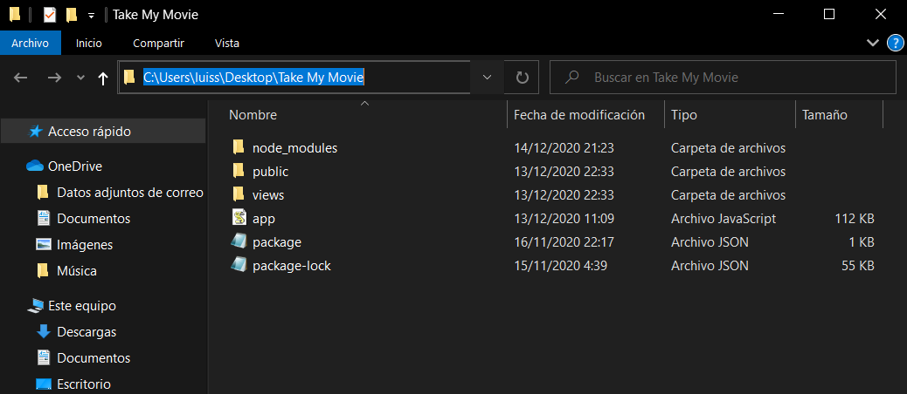

# SIBI
Documentos relacionados con la asignatura SISTEMAS DE INFORMACIÓN DE GESTION Y BUSINESS INTELLIGENGE
# Take My Movie

Take My Movie es un proyecto que consta de una página web online de películas, la cual cuenta con un sistema de recomendación de las mismas en base a búsquedas previas

## Comenzando 🚀

Estas instrucciones te permitirán obtener una copia del proyecto en funcionamiento en tu máquina local para propósitos de desarrollo y pruebas


### Pre-requisitos 📋

Qué cosas necesitas para instalar el software y como instalarlas

```
Visual Studio Code, Sublime Text, etc. Cualquier editor de texto.
```

### Instalación 🔧

Descargar en formato ZIP el archivo Take My Movie del Github (y extraerlo) donde se podrán encontrar los diferentes archivos

```
/public, /views, /app.js, /package-lock.json, /package.json
```

Arrancar una terminal **cmd**, posicionarse en el directorio donde se encuentre la carpeta anteriormente descargada y utilizar este comando

```
npm install
```

Si todo ha ido bien, se nos creará una carpeta dentro del propio folder "Take My Movie" que se llame "node_modules".
Esto nos permitirá utilizar el Nodejs para hacer funcionar la página web.

Lo siguiente que habría que hacer es dirigirse a https://sandbox.neo4j.com/ y crear un nuevo proyecto donde vamos a insertar todos los datos de mis .csv
Al crear la sandbox, insertaremos paso por paso todos los comandos que se encuentran en el archivo *Pasos a seguir Neo4j Sandbox* en mi Github

## Ejecutando las pruebas ⚙️

Esto será lo que veas al realizar lo anterior explicado.



### Y las pruebas de estilo de codificación ⌨️

_Explica que verifican estas pruebas y por qué_

```
Da un ejemplo
```

## Despliegue 📦

_Agrega notas adicionales sobre como hacer deploy_

## Construido con 🛠️

_Menciona las herramientas que utilizaste para crear tu proyecto_

* [Dropwizard](http://www.dropwizard.io/1.0.2/docs/) - El framework web usado
* [Maven](https://maven.apache.org/) - Manejador de dependencias
* [ROME](https://rometools.github.io/rome/) - Usado para generar RSS

## Contribuyendo 🖇️

Por favor lee el [CONTRIBUTING.md](https://gist.github.com/villanuevand/xxxxxx) para detalles de nuestro código de conducta, y el proceso para enviarnos pull requests.

## Wiki 📖

Puedes encontrar mucho más de cómo utilizar este proyecto en nuestra [Wiki](https://github.com/tu/proyecto/wiki)

## Versionado 📌

Usamos [SemVer](http://semver.org/) para el versionado. Para todas las versiones disponibles, mira los [tags en este repositorio](https://github.com/tu/proyecto/tags).

## Autores ✒️

_Menciona a todos aquellos que ayudaron a levantar el proyecto desde sus inicios_

* **Andrés Villanueva** - *Trabajo Inicial* - [villanuevand](https://github.com/villanuevand)
* **Fulanito Detal** - *Documentación* - [fulanitodetal](#fulanito-de-tal)

También puedes mirar la lista de todos los [contribuyentes](https://github.com/your/project/contributors) quíenes han participado en este proyecto. 

## Licencia 📄

Este proyecto está bajo la Licencia (Tu Licencia) - mira el archivo [LICENSE.md](LICENSE.md) para detalles

## Expresiones de Gratitud 🎁

* Comenta a otros sobre este proyecto 📢
* Invita una cerveza 🍺 o un café ☕ a alguien del equipo. 
* Da las gracias públicamente 🤓.
* etc.


---
⌨️ con ❤️ por [Villanuevand](https://github.com/Villanuevand) 😊
